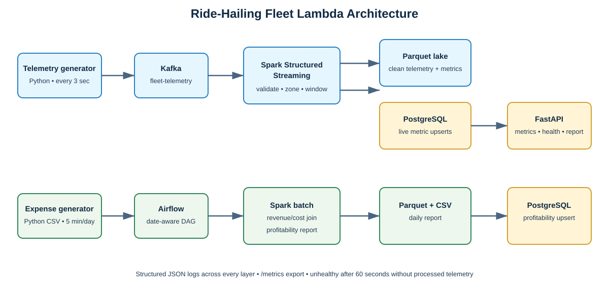

# Ride-Hailing Fleet Data Platform

**Module:** EC8203 Applied Big Data Engineering
**Assessment:** Data Engineering Mini-Project
**Team:** Replace with the three members’ names and student numbers
**Repository:** Replace with final repository URL
**Demonstration date:** Replace before submission

## Executive summary

This project implements an end-to-end data platform for a ride-hailing fleet
operator. The operator needs near-real-time visibility of the fleet while also
reconciling revenue against a daily cost feed from fuel and garage partners. The
platform accepts continuous GPS/telemetry events through Kafka, calculates
five-minute utilization and earnings by Colombo zone using Spark Structured
Streaming, and retains clean events in Parquet. A daily expense CSV is generated
for every fleet vehicle; a Spark batch job joins it to deduplicated trip revenue
and calculates vehicle profitability. PostgreSQL provides queryable serving
tables, FastAPI exposes the operational view, and Airflow orchestrates the
daily batch workflow.

The scenario uses 20 simulated vehicles. One simulated day is compressed to
five real minutes, allowing both processing paths and the daily reconciliation
to be demonstrated in one laboratory session. The delivered system answers the
business questions "what is happening now?" and "which vehicles are losing
money after costs?" without treating the two very different latency requirements
as the same pipeline problem.

## 1. Use case and business requirements

The selected use case is **Ride-Hailing Fleet Operations**. Each event contains
`trip_id`, `driver_id`, `vehicle_id`, location, speed, operational status, fare
and UTC timestamp. Status is one of `idle`, `enroute` or `on_trip`. The second
source emits one CSV per logical day with `fuel_cost`, `maintenance_cost`,
`distance_covered` and `service_flag` per vehicle.

The live question is fleet utilization and observed earnings by area/time
window. The historic question is which vehicles become unprofitable once the
daily costs are applied. Therefore the implementation must provide meaningful
cleaning, enrichment, windowing and joining rather than merely moving records
between tools. It must also expose a queryable output, structured logs and an
alert/health rule.

## 2. Architecture decision: Lambda rather than Kappa

We selected a Lambda architecture. The speed layer consumes telemetry from
Kafka, validates it, enriches it with a reporting zone and publishes live
five-minute metrics. The batch layer is activated from the daily cost feed and
reconciles costs with retained clean telemetry. This design provides fast
operational visibility while allowing a complete, reproducible daily report.

Kappa was considered and rejected. Kafka replay could process a daily cost file
as events, but it would make a naturally periodic partner feed look like a
continuous source. It would also make the daily reporting schedule, data-date
selection and cost/revenue consistency harder to explain. Lambda adds two code
paths and requires consistency discipline; the common data contract, Parquet
retention and shared PostgreSQL schema mitigate that trade-off.



```text
Speed layer: telemetry generator -> Kafka -> Spark stream -> Parquet + PostgreSQL -> API
Batch layer: daily cost generator -> Airflow -> Spark batch -> Parquet/CSV + PostgreSQL -> API
```

## 3. Technology stack and justification

| Component | Choice | Justification |
| --- | --- | --- |
| Event ingestion | Apache Kafka | Partitions and durable offsets suit frequent independent vehicle events. |
| Stream/batch engine | Spark Structured Streaming + Spark SQL | Provides event-time windows for the speed path and DataFrame joins for the batch path. |
| Raw/analytical storage | Parquet | Columnar, compact, replayable and directly queryable from Spark. |
| Serving storage | PostgreSQL | Strong relational keys/upserts and lightweight querying for a small operational dashboard. |
| API | FastAPI | Clear typed HTTP endpoints and generated OpenAPI documentation. |
| Orchestration | Apache Airflow | Makes the daily source, dependency order and date-aware batch job observable/retryable. |
| Runtime packaging | Docker Compose | Reproduces Kafka, PostgreSQL, API and optional Airflow services. |

Kafka is configured as a single-node KRaft broker because the project is a
demonstration rather than a production cluster. PostgreSQL is appropriate at
this scale; a production system could use a warehouse or a time-series store.

## 4. Data ingestion and processing design

The streaming generator emits an event every three seconds by default. The
Kafka producer uses acknowledgements from all in-sync replicas (within this
single-node demonstration), retries transient sends and writes a structured JSON
log containing vehicle, topic, partition and offset. The daily generator writes
the CSV atomically via a temporary file and prevents accidental same-date replay
unless an explicit overwrite option is used.

Spark parses the Kafka JSON with an explicit schema. It drops events with null
identifiers/timestamps, invalid statuses, negative fares or implausible speed.
It derives an event timestamp and maps the simulated Colombo rectangle into
south-west, south-east, north-west and north-east reporting zones. A two-minute
watermark and five-minute event-time window control late data and create live
metrics: total events, idle/on-trip/active counts, observed earnings, mean speed
and idle ratio.

The daily job selects one report date, de-duplicates trip records by vehicle and
trip identifier, takes the maximum observed fare per trip, aggregates revenue by
vehicle, and left-joins the expense feed. It calculates total expense, profit,
profit margin and an unprofitable flag. A left join ensures a vehicle with costs
but no recorded trip remains visible and is correctly identified as unprofitable.

### Data quality and consistency controls

The pipeline explicitly validates operational status, timestamp, identifiers,
speed and fare before downstream aggregation. Invalid events are excluded from
the metrics rather than silently corrupting the idle ratio or revenue. The
stream watermark is two minutes, which is appropriate for a demonstration
source that emits every three seconds while still showing how late event policy
is made explicit. The daily feed is atomically published and date-labelled;
this avoids a consumer reading a half-written file and provides a deterministic
input to a re-run.

Both serving writes use deterministic keys. A Spark micro-batch can retry after
a transient database problem without duplicating a zone/window metric, and the
batch job can rerun a report date without multiplying vehicle rows. Parquet is
kept alongside PostgreSQL so the derived output can be recomputed if a serving
load fails or a transformation rule changes.

## 5. Storage and serving layer

The stream writes clean telemetry and update-mode aggregation snapshots to
Parquet. It additionally upserts current aggregation values keyed by
`(window_start, window_end, zone)` into PostgreSQL. The daily report is written
to both partitioned Parquet and a human-readable CSV directory, then upserted
by `(report_date, vehicle_id)`. These keys make retries idempotent rather than
creating duplicate dashboard records.

FastAPI provides:

- `GET /metrics/fleet` for all zones in the newest window;
- `GET /reports/profitability/{YYYY-MM-DD}` for the selected daily report and
  unprofitable-vehicle summary;
- `GET /health` for pipeline freshness and database availability; and
- `GET /metrics` for Prometheus-style serving gauges/counters.

**[INSERT REAL SCREENSHOT: FastAPI docs and `/metrics/fleet` response]**

## 6. Orchestration and observability

The Airflow DAG `daily_fleet_profitability_reconciliation` is scheduled every
five minutes, matching the simulated day. It creates a dated cost feed, passes
the precise output path to the reconciliation task, executes the Spark batch
job and loads its results into PostgreSQL. Making the date explicit prevents a
daily feed from being joined to an unintended report date.

All producer, generator, Spark and API lifecycle messages are structured JSON.
The API records request/error counters and serving-row/telemetry-age gauges.
The basic alert rule marks the service unhealthy if no streaming metric has been
processed for more than 60 seconds. It persists health-state transitions to the
`pipeline_alerts` table. This is a useful demo rule because it detects a stopped
producer, Kafka interruption or failed Spark stream without needing an external
monitoring product.

**[INSERT REAL SCREENSHOT: successful Airflow DAG]**
**[INSERT REAL SCREENSHOT: `/health` 503 no-data alert, then recovery]**

## 7. Results and demonstration evidence

The completed demonstration must show JSON producer messages, Spark processing
logs, current API metrics, one daily CSV, a profitability result and the health
alert. The expected report contains all 20 simulated vehicles and identifies
vehicles whose cost exceeds retained trip revenue. The exact counts and values
are intentionally not fabricated in this report; they must come from the final
run because the sources are random.

**[INSERT REAL SCREENSHOT: Spark `utilization_metrics_batch_written` log]**
**[INSERT REAL SCREENSHOT: generated profitability CSV/API report]**

### Test strategy

Automated unit tests verify the generator contracts, zone mapping, daily-file
replay protection, health rule and serving-schema coverage. Docker Compose
validates service composition. The demonstration checklist adds integration
verification of PostgreSQL table initialisation and the API endpoints with
real processed data. The most important acceptance tests are intentionally
business-facing: the newest-window endpoint must contain the requested live
metrics, and the daily endpoint must contain all 20 vehicles and flag loss-making
ones.

## 8. Limitations and production-scale improvements

The project intentionally uses random data, a simple coordinate grid and a
single Kafka broker. The fare model is simplified, and a telemetry event is not
a full immutable trip lifecycle. At production scale, zones would come from a
GIS polygon service, trip revenue would come from a transactional trip source,
and schema validation would use a registry. Kafka would have multiple brokers,
TLS/SASL authentication, monitored consumer lag and retention controls.

Spark checkpoints and Parquet would live in object storage rather than the
developer machine. A production serving store would use secrets management,
migrations, connection pooling, authentication/rate limits, distributed metrics
and alert routing. Airflow credentials would never appear in Compose values.
These limitations are accepted for a transparent two-week mini-project and are
documented so that the difference between a classroom demo and a production
platform is explicit.

## 9. Security, operations and cost considerations

The Compose credentials are intentionally simple local-demo values and must not
be reused in deployment. At production scale, credentials would be injected
through a secret manager and API access would require authentication and HTTPS.
The current PostgreSQL upsert approach trades very low operational complexity
for limited throughput; a warehouse loader or a dedicated streaming sink would
be used for a much larger fleet. The simple health rule is deliberately local
and explainable. A real operations team would route alerts to a managed system,
track Kafka consumer lag and collect distributed traces.

Keeping clean events as Parquet avoids retaining every raw event in the serving
database and makes the storage cost predictable. The five-minute aggregate is
small enough for PostgreSQL to query interactively. These choices match the
project's scale while showing how storage, serving latency and observability
trade-offs change at production volume.

## 10. Individual contributions

Replace the placeholders below with the team’s approved final statement.

| Member | Contribution |
| --- | --- |
| Member 1 | Telemetry simulator, Kafka producer/broker configuration and source tests. |
| Member 2 | Daily source, Spark streaming/batch processing, Parquet/PostgreSQL integration, API, Airflow, observability, documentation and tests. |
| Member 3 | Independent end-to-end review, evidence capture, demo video, report finalisation and submission integration. |

## 11. Reproducibility

The root README contains exact local run commands. Docker Compose starts Kafka,
PostgreSQL and FastAPI by default; Airflow is enabled through the
`orchestration` profile. `docs/DEMO_AND_SUBMISSION_CHECKLIST.md` defines the
clean-clone test procedure and required screenshots. The repository excludes
generated data, virtual environments, Maven/Ivy artefacts and credentials.

## References

1. Apache Kafka, *Documentation*. https://kafka.apache.org/documentation/
2. Apache Spark, *Structured Streaming Programming Guide*.
   https://spark.apache.org/docs/3.5.5/structured-streaming-programming-guide.html
3. Apache Airflow, *Documentation*. https://airflow.apache.org/docs/
4. PostgreSQL Global Development Group, *PostgreSQL Documentation*.
   https://www.postgresql.org/docs/
5. FastAPI, *Documentation*. https://fastapi.tiangolo.com/
